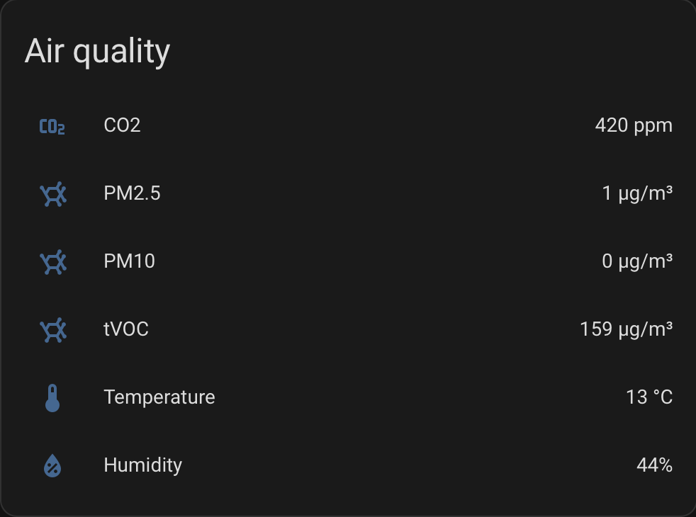

# Qingping Air wifi integration

That integration intended for using with [Qingping Air with wifi](https://www.qingping.co/air-monitor/overview), through [cloud API integration](https://developer.qingping.co/main/guide/introduce). Out-of-the-box HASS Qingping integration working with BLE version only. Another integrations such as `xiaomi_iot` did't work properly with cloud in my case (my version doesn't work with Xiaomi Mi Home app for some reason), so I developed that simple integration.



## Install and setup the component

* Copy the entire `qingping_air_wifi` directory to the `custom_components` folder of your Home Assistant installation. If you can't find the `custom_components` directory at the same level with your `configuration.yml` — simply create it yourself and put `qingping_air_wifi` there.
* Go to your [personal account > Access management](<https://developer.qingping.co/personal/permissionApply>)
* Copy `App Key` and `App Secret`
* Open `secrets.yaml` and paste your credentials in the same way:

    ```yaml
    qingping_client_id: "your app key"
    qingping_client_secret: "your app secret"
    ```

* Open `configuration.yaml` and edit it in the same way:

    ```yaml
    sensor:
    - platform: qingping_air_wifi
    client_id: !secret qingping_client_id
    client_secret: !secret qingping_client_secret
    ```

* Go to Home Assistant web interface -> `Developer Tools` -> `Check and Restart` and click "Restart" button. It will reload all components in the system.

Also, you can use [this article](https://touch-max.ru/umnyj-dom/otvyazka-clear-grass-air-monitor-ot-oblaka-i-podklyuchenie-k-home-assistant)

## Limitations

The component supports only 1 device. If you have more than one device in your account, so I'm waiting for PR :).
